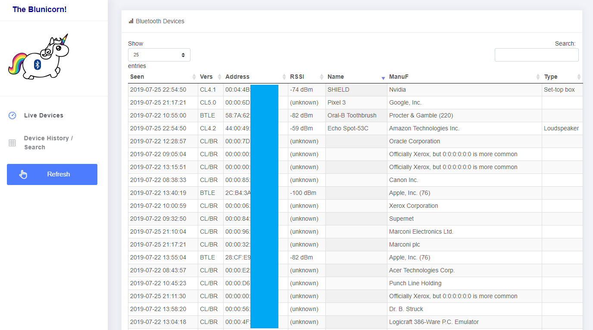

# BlueUI

 Blue UI is a simple web interface for [blue_hydra](https://github.com/ZeroChaos-/blue_hydra) that allows you to search the data as well as view active/daily and total devices seen.
 
 *Live Devices* is displayed similar to the [blue_hydra](https://github.com/ZeroChaos-/blue_hydra) interface and can be queried on the fly by selecting any of the devices to view the rest of its details.
 
 *Device History / Search* gives you the ability to search for devices seen at anytime as well as query them. It also displays all of the information available about a device rather than the limited selection available in live view.
 
# Requirements
Python: Flask

To install just use `pip3 install flask`

# Running with gunicorn
To have the application run via gunicorn rather than stand alone python you can use
`gunicorn3 --bind 0.0.0.0:80 wsgi:app`

# Installing as a service ( on Debian )
- Blue UI
To install as a service you will need to have [blue_hydra](https://github.com/ZeroChaos-/blue_hydra) running with the API flag ( default --mohawk-api ) and then add the following service file to /etc/systemd/system

```blue_ui.service```
```
[Unit]
Description=gunicorn3 blue_ui daemon
After=network.target

[Service]
User=pi
Group=pi
WorkingDirectory=/home/pi/blue_ui
ExecStart=/usr/bin/gunicorn3 --bind 0.0.0.0:80 wsgi:app
Restart=always

[Install]
WantedBy=multi.user.target
```

- Blue Hydra (optional)

```blue_hydra.service```
```[Unit]
Description=blue_hydra with systemd, respawn, after bluetooth
After=bluetooth.target

[Service]
ExecStart=./home/pi/blue_hydra/bin/blue_hydra -d --mohawk-api
Restart=always

[Install]
WantedBy=multi-user.target
```

Next you can enable each service and then install them to run:
- sudo service blue_hydra enable
- sudo service blue_hydra start
- sudo service blue_ui enable
- sudo service blue_ui start

You will be able to check the status of both by doing `sudo service <name> status`

# Screenshots
## Live View


## Historical View


## Device Properties

